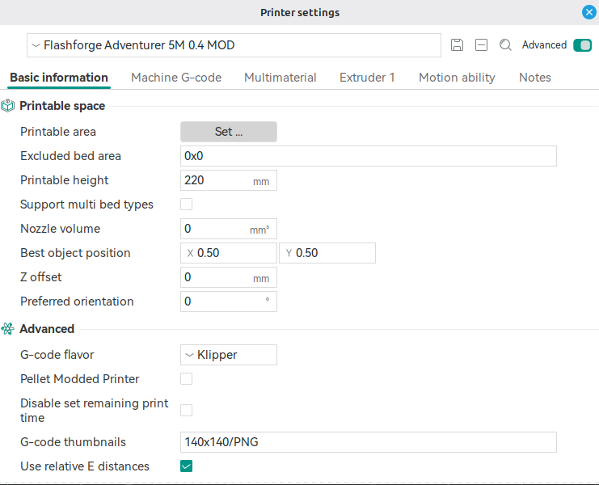
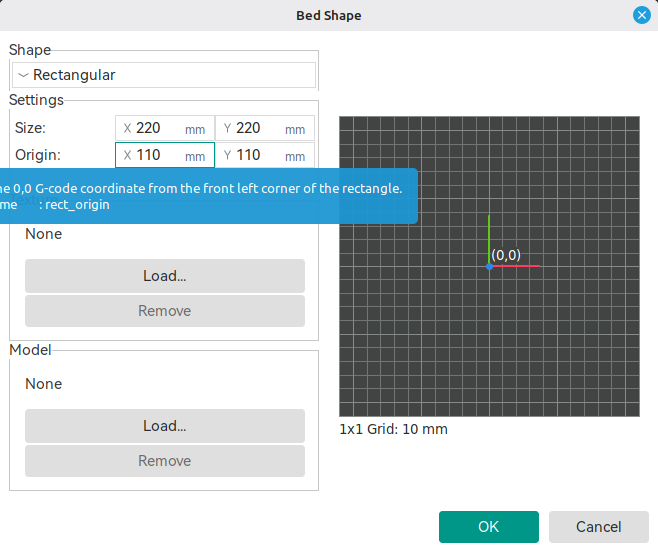
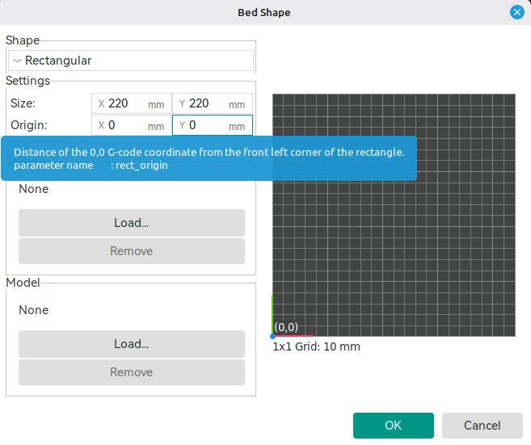

After installing klipper_mod (from xblax) is origin (X0,Y0) at the center of the buildplate. Homing position is X110 and Y110.
Here are steps, if you need origin in the front left corner (X0,Y0) and homing position at X220, Y220.

Changes in printer.base.cfg:
1. first step
2. second step
.
.
.
last step.

Changes in printer.cfg:
1. first step
2. second step
.
.
.
last step.

Changes in macros.cfg/macros-pro.cfg:
1. first step
2. second step
.
.
.
last step.

Changes in macros.cfg/macros-pro.cfg:
1. first step
2. second step
.
.
.
last step.

Changes in OrcaSlicer:
1. open settings for your printer profile
   
2. Select "set" for printable area
   
3. Change "origin" coordinates to X0 and Y0.
   
4. Dont forget change your start/end gcodes!!!
